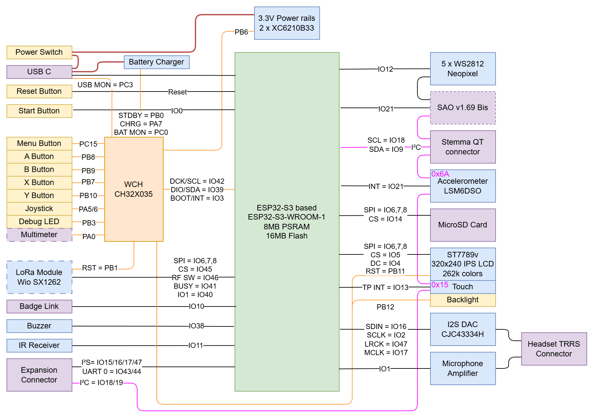

# Badge 2026 documentatie

## Aansluitingen

Wanneer je de badge vast hebt zals je zien dat er al aardig wat aansluitmogelijkheiden zijn. Hieronder in het kort een somenvatting van de aanwezige en optionele aansluitingen op de badge.

### Standaard aanwezig
- USB-C (max power draw?)
- Headset (TRRS: stereo audio + mic input)
- badge expansion connector (12 pinnen beschikbaar, IO en verschillende voedingen)
- MicroSD card 

### Optioneel
- **[SAO](https://hackaday.io/project/175182-simple-add-ons-sao) connector**, ideaal voor uitbreidingen zoals [ToF addon](../tof)
- Een **"multimeter" aansluiting** waarbij je +3.3V, GND en een analoge ingang pin van de [WCH CH32X035](https://www.wch-ic.com/products/CH32X035.html) microcontroller ter beschikking hebt. Met wat handig rekenwerk en een stukje code kan je hier dus spanningen tot 15V mee meten of weerstandswaardes nameten. Let wel op, er zit geen enkele vorm van protectie op deze pin, iets wat bij een gewone multimeter uiteraard wel aanwezig is. Wees dus voorzichtig bij het gebruik hiervan.
- Voor de mensen die de LoRa kit hebben gekocht is er nog een **LoRa antenna aansluiting** voorzien. Hier kan je de meegeleverde spiraal antenna op solderen of de optioneel beschikbare SMA connector plaatsen. Het voordeel van die SMA connector is dat je makkelijk van antenne kan wisselen. Denk dan bijvoorbeeld aan een directionele antenne wanneer je met [foxhunting](https://en.wikipedia.org/wiki/Transmitter_hunting) bezig bent en een omnidirectionele antenna voor normaal gebruik.
- Ook de **Badge Link / Blaster connector** is wederom voorzien op de badge. Deze is compatible met de <a href="/badge_2024/blaster-2022/">Time Blaster van 2022</a> en <a href="/badge_2024/flamingo">de BFG 9000 van 2024</a>.

## Hardware
De badge bestaat deze editie niet uit 1, maar **2** microcontrollers! Naast de vertrouwde [ESP32-S3](https://www.espressif.com/en/products/socs/esp32-s3) Wi-Fi microcontroller van Espessif, kan je ook een kleine [CH32X035](https://www.wch-ic.com/products/CH32X035.html) chip van WCH terugvinden. Deze compacte, en vooral goedkope, microcontroller gebruiken we om het gebrek aan IO pinnen van de [ESP32-S3](https://www.espressif.com/en/products/socs/esp32-s3) te verhelpen. We doen dit door enkele functies die een beperkte snelheid hebben, of zeer specifiek zijn voor het bord, te verzamelen op deze microcontroller en deze via een [I²C verbinding](https://en.wikipedia.org/wiki/I2C) door te sturen naar de [ESP32-S3](https://www.espressif.com/en/products/socs/esp32-s3) chip. In het blokschema kan je snel zien welke functies er verbonden zijn met de [CH32X035](https://www.wch-ic.com/products/CH32X035.html) chip, deze pin nummers beginnen met **PA**, **PB** of **PC** gevolgd door een nummer. Ook de overige connecties naar de [ESP32-S3](https://www.espressif.com/en/products/socs/esp32-s3) kan je zien op dit blokschema, deze beginnen met **IO** gevolgd door een nummer.

## Software
De [ESP32-S3](https://www.espressif.com/en/products/socs/esp32-s3) draait standaard [MicroPythonOS](https://micropythonos.com/)

Op de extra [CH32X035](https://www.wch-ic.com/products/CH32X035.html) microcontroller, die je kan terugvinden op de badge, draait [standaard firmware](https://github.com/Fri3dCamp/badge_2026_fw) die deze microcontroller laat werken als een IO expander chip via een I²C interface.