# Communicator add-on

Om je communicator te doen werken, moet je deze nog assambleren alvorens je deze kan aansluiten ops de badge.

## HARDWARE

### Communicator eigenschappen

De communicator bestaat uit:

- QWERTY toetsenbord met achtergrond verlichting ontworpen door [Solder Party](https://www.solder.party/)
- op RISC-V gebaseerd microcontroller - [WCH CH32X035](https://www.wch-ic.com/products/CH32X035.html)
- [TDK ICS43434](https://invensense.tdk.com/products/ics-43434/) microfoon
- [Analog Devices MAX98357A](https://www.analog.com/en/products/max98357a.html) DAC met versterker
- kleine luidspreker

Je kan het toetsenbord ook als USB toetsenbord gebruiken.

De ontwerp- en bronbestanden kan je terugvinden in de [GitHub repository](https://github.com/Fri3dCamp/communicator_2026)

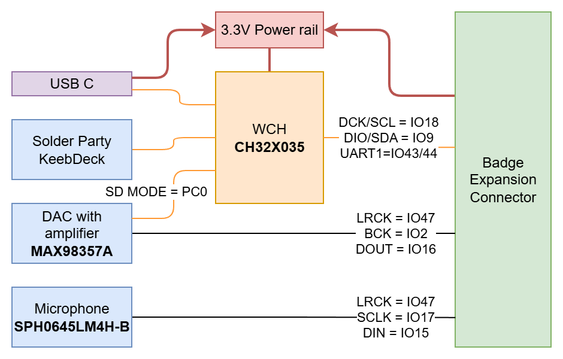

### Stap voor stap assemblage handleiding

#### Alle componenten netjes verpakt

Het pakje dat je ontvangen hebt bevat alles wat je nodig hebt om de communicator add-on te bouwen

- Communicator printplaat
- Gekleurde afdekplaat
- 4 x lange plastieken pin
- 4 x 2mm korte plastieken pin
- luidspreker
- siliconen toetsenbord
- 1 x 2x6 pinheader met extra lange pinnen

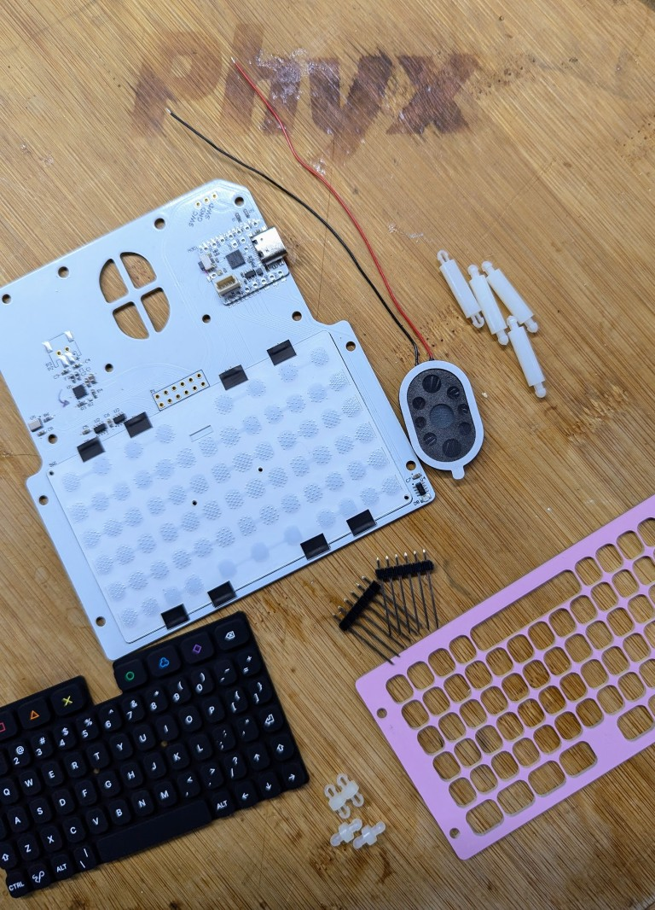

#### Monteer de luidspreker

Verwijder de plastieken laag om de luidspreker op de printplaat te kleven. Soldeer de 2 draden op de printplaat zoals op de foto hieronder. De rode draad moet naar het soldeervlak gaan dat gemarkeerd is met een `+`

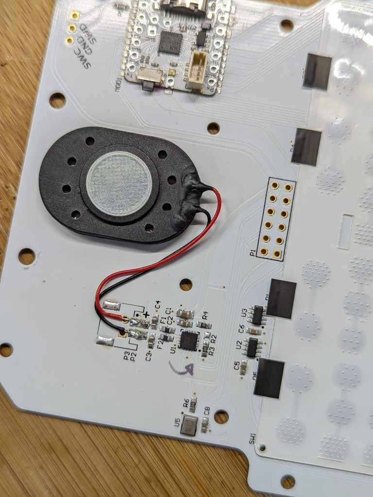
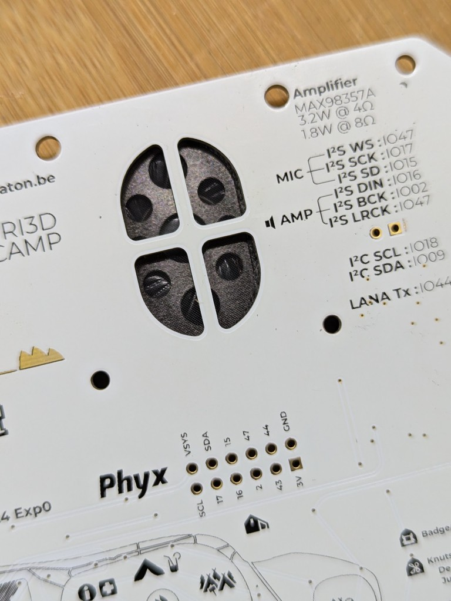

#### Soldeer de lange pinnen

Plaats de lange pinnen aan de zijde met alle componenten. Je kan een andere vrouwelijke connector (of zelfs de badge) gebruiken om de 2 losse pinnen stroken netjes op een rijtje te houden tijdens het solderen.

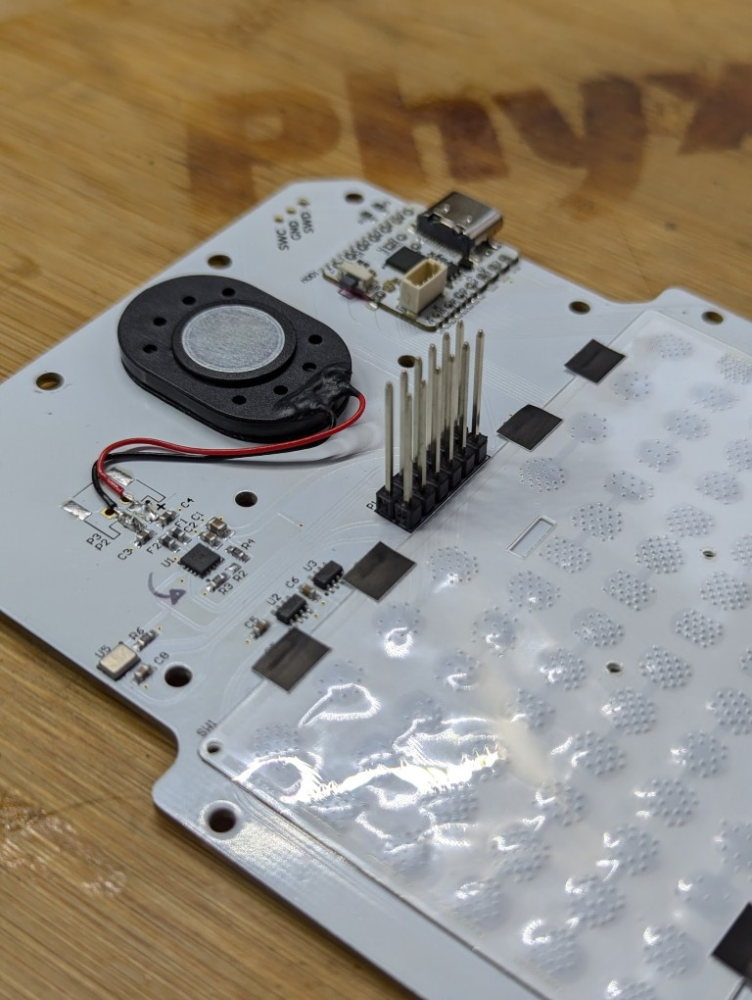

#### Monteer het toetsenbord

Duw de 2mm lange plastieken pinnetjes in de roze cover zoals getoond op de foto's hieronder. Leg het siliconen toetsenbord er in en klik het geheel op de communicator printplaat.

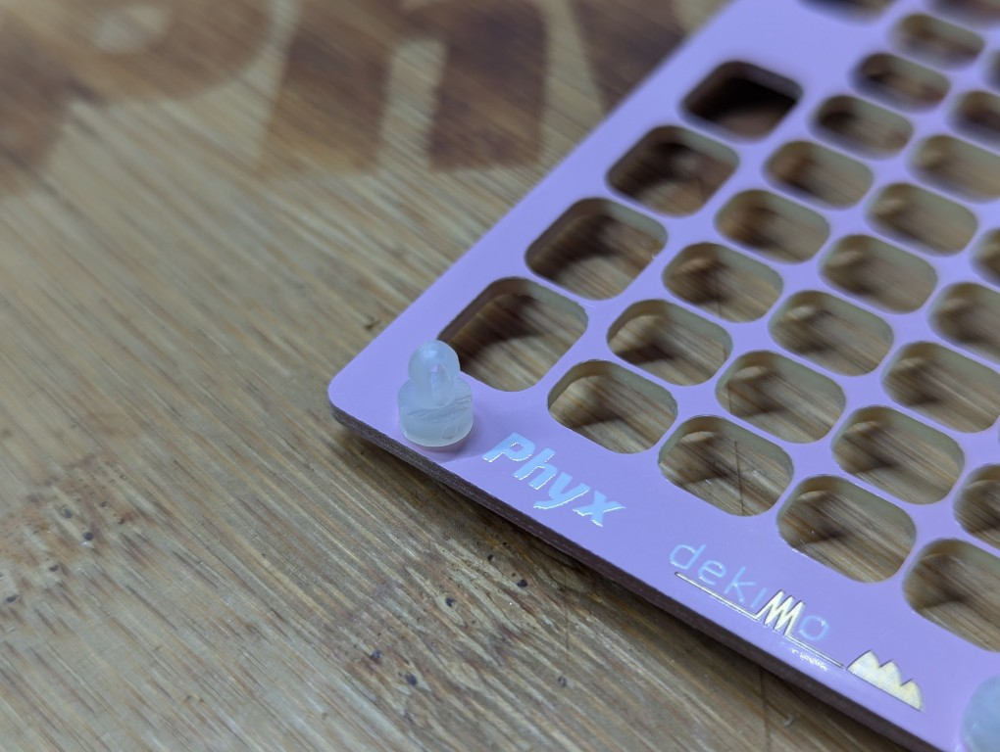
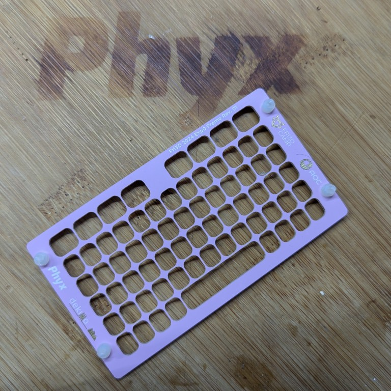
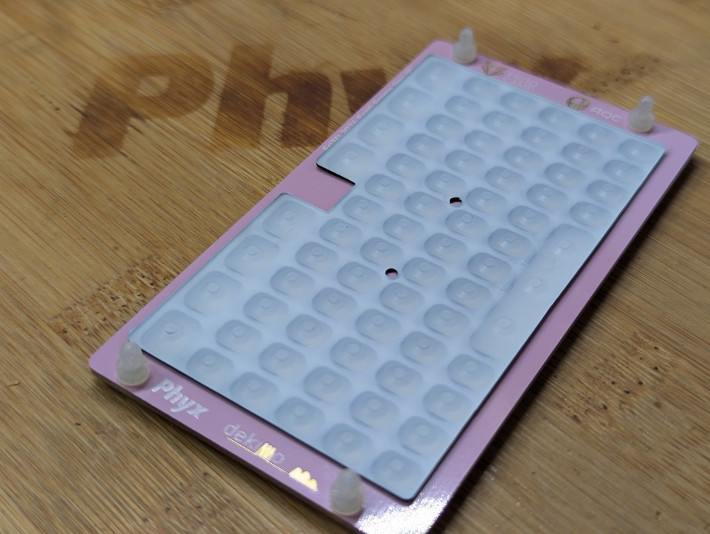
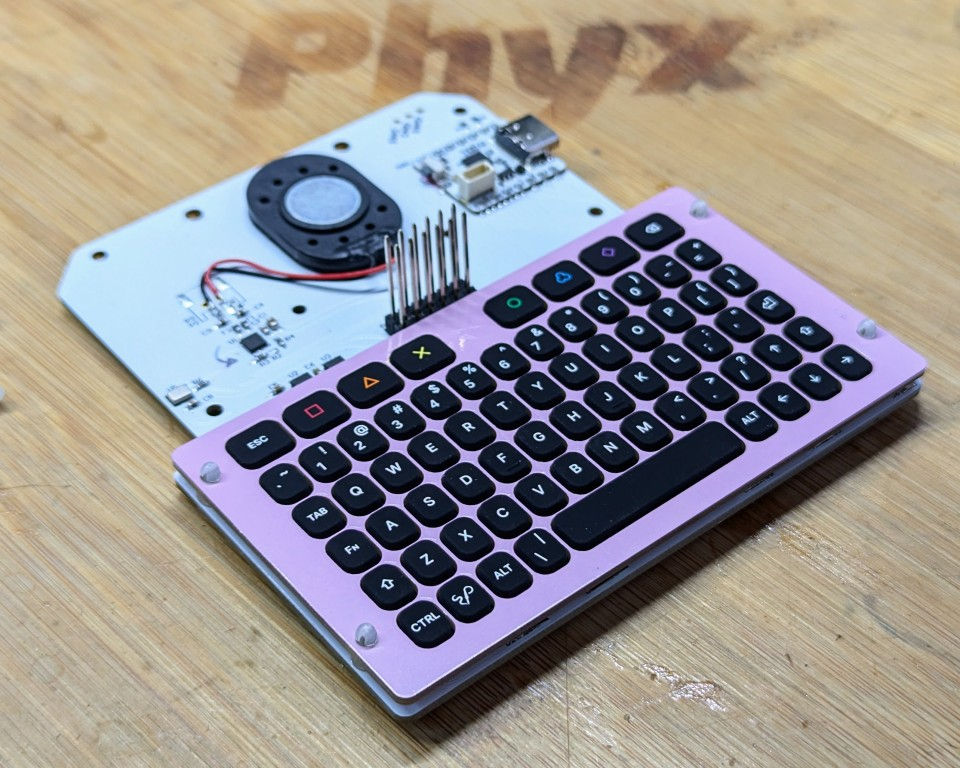

#### Verbind de communicator met de badge

Duw de lange plastieken pinnetjes in de 4 gaten die overeenkomen met de badge. Verwijder de beschermende achterplaat en duw de communicator op zijn plaats.

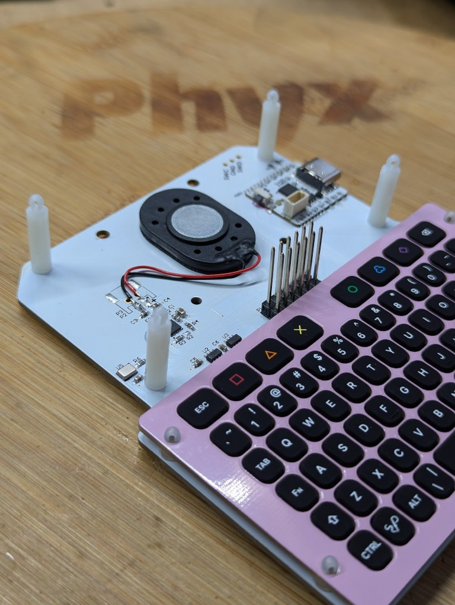
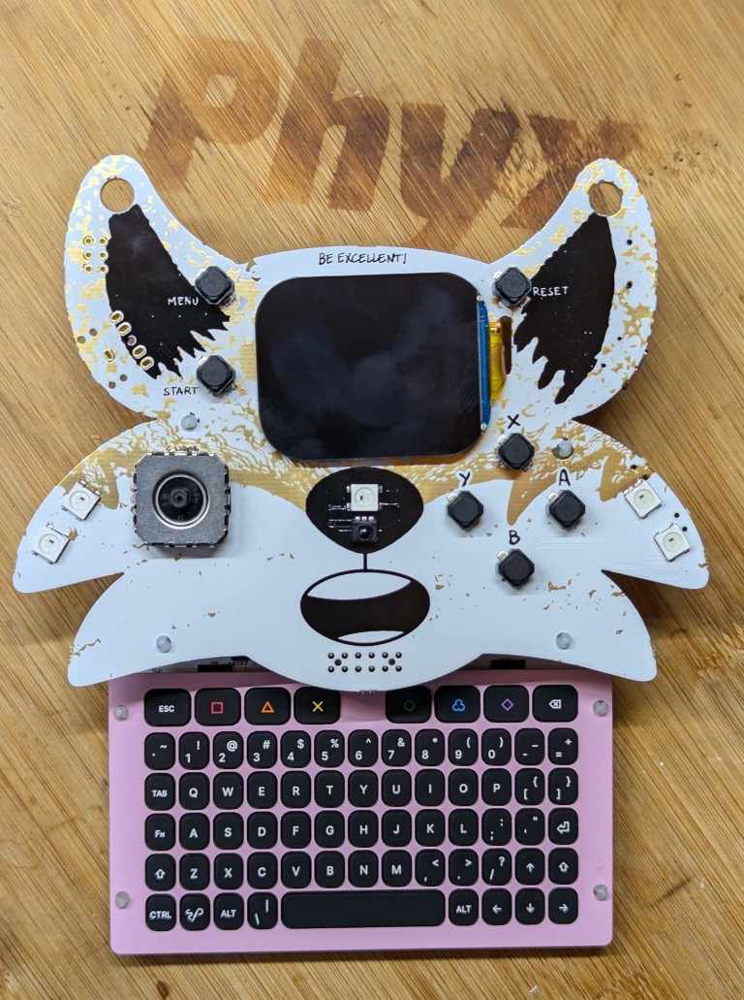

### Gebruik

Het toetsenbord doet zich voor als een HID input toestel op USB.
Met de `Fn` toets kan je speciale functies activeren:

- `Fn+Backspace`: Delete
- `Fn+Omhoog`: Page Up
- `Fn+Omlaag`: Page Down
- `Fn+Links`: Home
- `Fn+Rechts`: End
- `Fn+Spatiebalk`: schakel de achtergrond verlichting aan/uit
- `Fn+Rechtse Shift`: Schakel Caps Lock

### Firmware functies

De firmware stuurt [HID pakketten](https://files.microscan.com/helpfiles/ms4_help_file/ms-4_help-02-46.html) (8 bytes) uit op USB, I²C (adres `0x40`) en UART.

De eerste byte geeft aan welke modificatietoetsen zijn ingedrukt:

| Bit | Modifier Key |
| --- | ------------ |
| 0   | LINKSE CTRL    |
| 1   | LINKSE SHIFT   |
| 2   | LINKSE ALT     |
| 3   | LINKSE GUI     |
| 4   | RECHTSE CTRL   |
| 5   | RECHTSE SHIFT  |
| 6   | RECHTSE ALT    |
| 7   | RECHTSE GUI    |

De tweede byte is gereserveerd, de overige 6 bytes kunnen een [HID-sleutelcode](https://gist.github.com/MightyPork/6da26e382a7ad91b5496ee55fdc73db2) bevatten.

&nbsp;<br>
## SOFTWARE (FIRMWARE)

### Programmeren
De firmware zal op je microcontroller geflashed zijn. Echter, als het niet zou werken, kan je de firmware opnieuw flashen aan het `badge flash station` in de soldeer area.

Als je wil, kan je de firmware ook zelf flashen met je eigen laptop. Bijvoorbeeld mocht je de firmware willen updaten of zelf aanpassingen willen maken. De bronbestanden kan je terugvinden in de [GitHub repository](https://github.com/Fri3dCamp/communicator_2026)

### Compileren

De firmware gebruikt [platformio](https://platformio.org) om de code te compileren. Installeer ook zeker de [ch32v platform package](https://github.com/Community-PIO-CH32V/platform-ch32v). Om de debug versie van de firmware te compileren a.d.h.v de command line, typ dan:

```
pio run -e debug
```

Daarna kan je de firmware terugvinden op deze plaats: `.pio/build/debug/firmware.bin`.

Om de firmware te flashen naar je communicator, hou de knop dan ingedrukt waarna je de USB kabel naar je computer insteekt. Daarna run je:

```
pio run -e debug -t upload
```

Als alles goed loopt, is je communicator nu geherflasht met je eigen versie van de firmware.

### I²C

Zoals eerder vermeld kan de badge ook met de communicator communiceren via I²C (adres ```0x40```). De volgende registers kunnen aangesproken worden om gegevens op de vragen of weg te schrijven:

| Register | Naam | Permissies | Bytes | omschrijving |
|-|-|-|-|-|
| 0x00 | Versienummer | R | 3 | De versie van de firmware |
| 0x03 | huidig HID report packet | R | 8 | 8-byte HID report packet (zie hierboven) |
| 0x0b | Configuratie | R/W | 1 | een 1-byte configuratie register (zie hieronder) |
| 0x0c | Achtergrondverlichting | R/W | 2 | Toetsenbord achtergrond verlichting (0-100) |

De configuratie is een 1-byte waarde met de volgende betekenis voor elke bit:

| Bit | Name |
|-|-|
| \[7:2\] | gereserveerd |
| 1 | herstart naar bootloader |
| 0 | activeer interrupt mode (in ontwikkeling) |

### UART

Je kan ook vanuit de badge via [UART](https://nl.wikipedia.org/wiki/UART "ook wel seriële poort genoemd") met het keyboard communiceren. Dit gebeurt met de UART instellingen [115200 8N1](## "8 data bits, geen pariteits bit, 1 stop bit aan een snelheid van 115200 baud").

Het voordeel hiervan is dat de badge gewoon moet luisten naar inkomende HID pakketten via UART. Deze pakketten komen automatisch binnen zonder dat de badge moet pollen.

Je kan ook vanuit de badge 2 bytes naar de UART van de communicator versturen om de backlight in te stellen. De eerste byte moet een waarde tussen 0 en 100 zijn (de intensiteit van de achtergrondverlichting), de 2de byte moet het binair tegengestelde zijn van de eerste byte (XOR met 0xFF).
