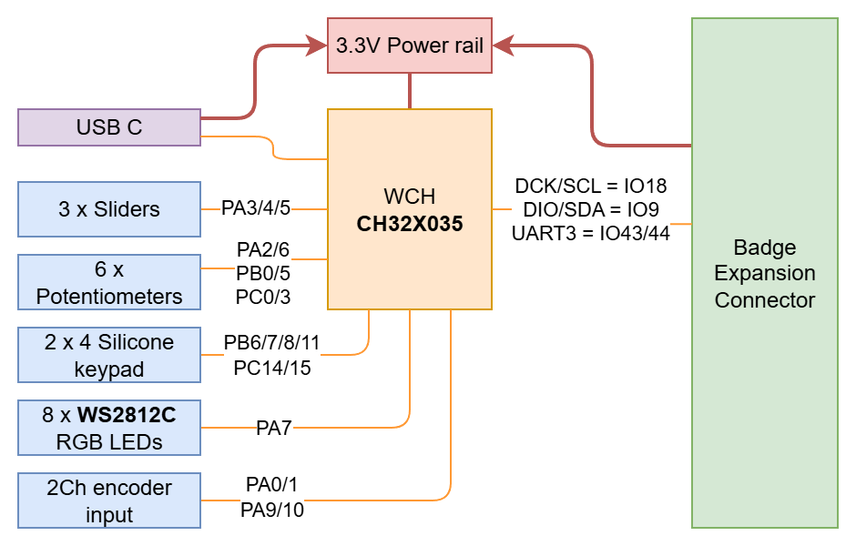

# DJ Add-on

Om je DJ Add-on te doen werken, moet je deze nog assambleren alvorens je deze kan aansluiten ops de badge.

## HARDWARE

### DJ add-on eigenschappen

De DJ addon bestaat uit:

- 6 potmeters
- 3 faders
- 8 knoppen
- 8 RGB LEDs (1 onder elke knop)
- 2 connectors voor rotary encoders
- 2 connectors voor harde schijven (zie verder)

Je kan de DJ add-on ook als [USB MIDI](https://midi.org/basic-of-usb) toestel gebruiken.

De ontwerp- en bronbestanden kan je terugvinden in de [GitHub repository](https://github.com/Fri3dCamp/dj_addon_2026)



### Stap voor stap assemblage handleiding

#### Alle componenten netjes verpakt

Het pakje dat je ontvangen hebt bevat alles wat je nodig hebt om de DJ add-on te bouwen

- DJ add-on printplaat
- 6 potmeters
- 3 faders
- 8 siliconen knoppen
- 4 M3 schroeven
- 1 x 2x6 pinheader met extra lange pinnen


#### Monteer de faders

TODO


#### Monteer de potmeters

TODO


#### Soldeer de lange pinnen

Plaats de lange pinnen aan de zijde met alle componenten. Je kan een andere vrouwelijke connector (of zelfs de badge) gebruiken om de 2 losse pinnen stroken netjes op een rijtje te houden tijdens het solderen.


#### Monteer het knoppen

TODO


#### Verbind de DJ add-on met de badge

TODO


### Gebruik

De DJ add-on doet zich voor als een [MIDI](https://midi.org/basic-of-usb) toestel. Je kan de DJ add-on via USB aansluiten op je computer, of via de expansion connector met je badge.

In alle gevallen worden volgende MIDI signalen uitgestuurd:

| Input | MIDI | Note | bereik |
|-|-|-|-|
| Potmeter links boven | CC | 0x40 | 0x00-0x7F |
| Potmeter links midden | CC | 0x41 | 0x00-0x7F |
| Potmeter links onder | CC | 0x42 | 0x00-0x7F |
| Fader links | CC | 0x43 | 0x00-0x7F |
| Potmeter rechts boven | CC | 0x50 | 0x00-0x7F |
| Potmeter rechts midden | CC | 0x51 | 0x00-0x7F |
| Potmeter rechts onder | CC | 0x52 | 0x00-0x7F |
| Fader rechts | CC | 0x53 | 0x00-0x7F |
| Fader onder | CC | 0x59 | 0x00-0x7F |
| Knop 1 | CC | 0x64 | 0x00 of 0x7F |
| Knop 2 | CC | 0x66 | 0x00 of 0x7F |
| Knop 3 | CC | 0x65 | 0x00 of 0x7F |
| Knop 4 | CC | 0x60 | 0x00 of 0x7F |
| Knop 5 | CC | 0x62 | 0x00 of 0x7F |
| Knop 6 | CC | 0x61 | 0x00 of 0x7F |
| Knop 7 | CC | 0x67 | 0x00 of 0x7F |
| Knop 8 | CC | 0x63 | 0x00 of 0x7F |
| Encoder links | CC | 0x44 | 0x00-0x7F |
| Encoder rechts | CC | 0x54 | 0x00-0x7F |

De LEDs onder de knoppen kunnen aangestuurd worden door volgende MIDI signalen naar de DJ add-on te sturen:

| LED | MIDI | Note | bereik |
|-|-|-|-|
| LED 1 | CC | 0x20 | 0x00-0x09 |
| LED 2 | CC | 0x21 | 0x00-0x09 |
| LED 3 | CC | 0x22 | 0x00-0x09 |
| LED 4 | CC | 0x23 | 0x00-0x09 |
| LED 5 | CC | 0x24 | 0x00-0x09 |
| LED 6 | CC | 0x25 | 0x00-0x09 |
| LED 7 | CC | 0x26 | 0x00-0x09 |
| LED 8 | CC | 0x27 | 0x00-0x09 |

De volgende tabel geeft de mapping weer tussen de MIDI waarden en de ingestelde kleur op de LED:

| Waarde | Rood | Groen | Blauw | Naam |
|-|-|-|-|-|
| 0x00 | 0x00 | 0x00 | 0x00 | LED uit |
| 0x01 | 0xc5 | 0x0a | 0x08 | orange-red |
| 0x02 | 0x32 | 0xbe | 0x44 | teal |
| 0x03 | 0x42 | 0xd4 | 0xf4 | yellow-green |
| 0x04 | 0xf8 | 0xd2 | 0x00 | warm white |
| 0x05 | 0x00 | 0x44 | 0xff | blue |
| 0x06 | 0xaf | 0x00 | 0xcc | cyan |
| 0x07 | 0xfc | 0xa6 | 0xd7 | white |
| 0x08 | 0xf2 | 0xf2 | 0xff | bright white |
| 0x09 | 0xff | 0x80 | 0x00 | green |

## SOFTWARE (FIRMWARE)

### Programmeren
De firmware zal op je microcontroller geflashed zijn. Echter, als het niet zou werken, kan je de firmware opnieuw flashen aan het `flash station` in de soldeer area.

Als je wil, kan je de firmware ook zelf flashen met je eigen laptop. Bijvoorbeeld mocht je de firmware willen updaten of zelf aanpassingen willen maken. De bronbestanden kan je terugvinden in de [GitHub repository](https://github.com/Fri3dCamp/dj_addon_2026) in de `firmware` subfolder.

### Compileren

De firmware gebruikt [platformio](https://platformio.org) om de code te compileren. Installeer ook zeker de [ch32v platform package](https://github.com/Community-PIO-CH32V/platform-ch32v). Om de debug versie van de firmware te compileren a.d.h.v de command line, typ dan:

```
pio run -e debug
```

Daarna kan je de firmware terugvinden op deze plaats: `.pio/build/debug/firmware.bin`.

Om de firmware te flashen naar je DJ Add-on, hou de knop dan ingedrukt waarna je de USB kabel naar je computer insteekt. Daarna run je:

```
pio run -e debug -t upload
```

Als alles goed loopt, is je DJ Add-on nu geherflasht met je eigen versie van de firmware.

### I2C

Zoals eerder vermeld kan de badge ook met de DJ add-on communiceren via I2C (adres ```0x3A```). De volgende registers kunnen aangesproken worden om gegevens op de vragen of weg te schrijven:

| Register | Naam | Permissies | Bytes | omschrijving |
|-|-|-|-|-|
| 0x00 | Versienummer | R | 3 | De versie van de firmware |
| 0x03 | Knoppen | R | 8 | elke bit geeft de status van een knop |
| 0x04 | Potmeter links boven | R | 2 | waarde 0-4095 |
| 0x06 | Potmeter links midden | R | 2 | waarde 0-4095 |
| 0x08 | Potmeter links boven | R | 2 | waarde 0-4095 |
| 0x0a | Fader links | R | 2 | waarde 0-4095 |
| 0x0c | Potmeter rechts onder | R | 2 | waarde 0-4095 |
| 0x0e | Potmeter rechts midden | R | 2 | waarde 0-4095 |
| 0x10 | Potmeter rechts boven | R | 2 | waarde 0-4095 |
| 0x12 | Fader rechts | R | 2 | waarde 0-4095 |
| 0x14 | Fader onder | R | 2 | waarde 0-4095 |
| 0x16 | Encoder links | R | 2 | waarde 0-127 |
| 0x18 | Encoder rechts | R | 2 | waarde 0-127 |
| 0x1a | LED 1 rood | R/W | 1 | waarde 0-255 |
| 0x1b | LED 1 groen | R/W | 1 | waarde 0-255 |
| 0x1c | LED 1 blauw | R/W | 1 | waarde 0-255 |
| 0x1d | LED 2 rood | R/W | 1 | waarde 0-255 |
| 0x1e | LED 2 groen | R/W | 1 | waarde 0-255 |
| 0x1f | LED 2 blauw | R/W | 1 | waarde 0-255 |
| 0x20 | LED 3 rood | R/W | 1 | waarde 0-255 |
| 0x21 | LED 3 groen | R/W | 1 | waarde 0-255 |
| 0x22 | LED 3 blauw | R/W | 1 | waarde 0-255 |
| 0x23 | LED 4 rood | R/W | 1 | waarde 0-255 |
| 0x24 | LED 4 groen | R/W | 1 | waarde 0-255 |
| 0x25 | LED 4 blauw | R/W | 1 | waarde 0-255 |
| 0x26 | LED 5 rood | R/W | 1 | waarde 0-255 |
| 0x27 | LED 5 groen | R/W | 1 | waarde 0-255 |
| 0x28 | LED 5 blauw | R/W | 1 | waarde 0-255 |
| 0x29 | LED 6 rood | R/W | 1 | waarde 0-255 |
| 0x2a | LED 6 groen | R/W | 1 | waarde 0-255 |
| 0x2b | LED 6 blauw | R/W | 1 | waarde 0-255 |
| 0x2c | LED 7 rood | R/W | 1 | waarde 0-255 |
| 0x2d | LED 7 groen | R/W | 1 | waarde 0-255 |
| 0x2e | LED 7 blauw | R/W | 1 | waarde 0-255 |
| 0x2f | LED 8 rood | R/W | 1 | waarde 0-255 |
| 0x30 | LED 8 groen | R/W | 1 | waarde 0-255 |
| 0x31 | LED 8 blauw | R/W | 1 | waarde 0-255 |

### UART

Je kan ook vanuit de badge via UART met de badge communiceren. Dit gebeurt met de UART instellingen 115200 8N1.

Het voordeel hiervan is dat de badge gewoon moet luisten naar inkomende MIDI pakketten via UART. Deze pakketten komen automatisch binnen zonder dat de badge moet pollen.

Je kan ook vanuit de badge MIDI pakketen naar de DJ ADd-on versturen om de LEDs in te stellen. Zie hiervoor de beschrijven van de MIDI paketten hierboven.
