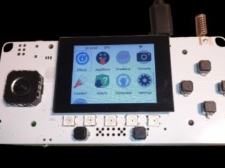

# Fri3d Camp Badge en Addons

Zoek je info voor een van deze borden? Klik dan onmiddellijk door naar die pagina.

## Fri3d Camp 2026

## Fri3d Camp 2024 

## Fri3d Camp 2022

## Aan de slag

De badge draait standaard [MicroPythonOS](https://docs.micropythonos.com/) en komt met een aantal [voorgeïnstalleerde applicaties](https://docs.micropythonos.com/apps/built-in-apps/) en een [app store](https://docs.micropythonos.com/apps/appstore/) waar je nog veel extra programmas kan vinden.

## Reset Standaard Firmware

Start je badge niet meer op of wil je terug naar de originele software gaan. Wandel dan even naar de badge / soldeer tent waar je het badge repair station zal vinden. Op deze PC kan je stapsgewijze instructies volgen om alle borden terug te flashen. Of kijk [hier hoe je ze zelf kan resetten](https://install.micropythonos.com/)

## Documentatie

- [De hardware](https://github.com/Fri3dCamp/badge_2026_hw)
- [Standaard OS}(https://micropythonos.com/)