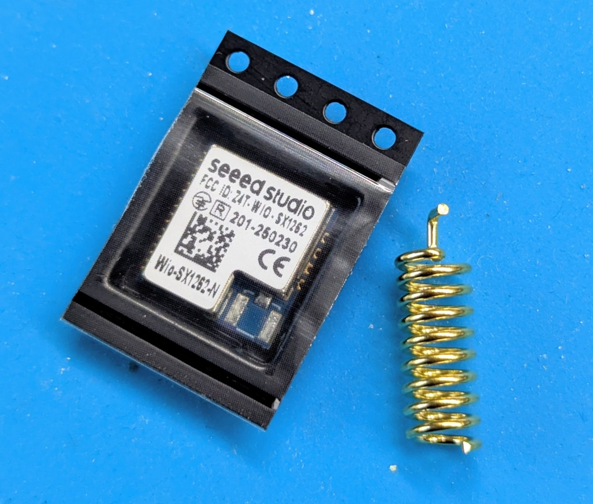
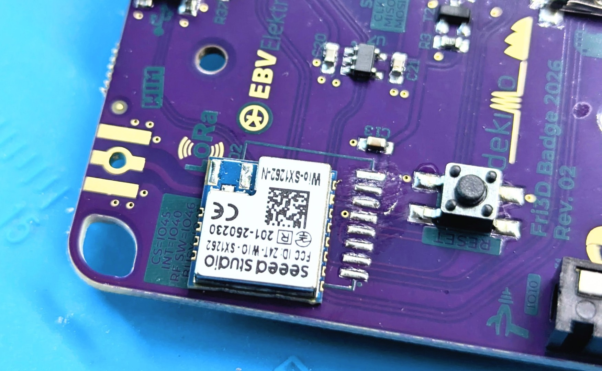
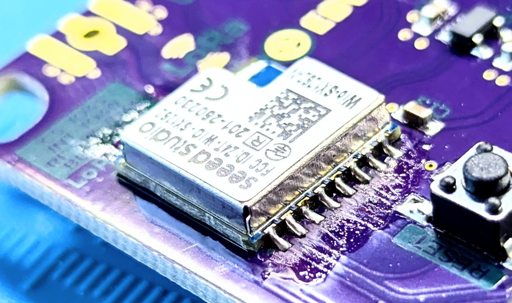
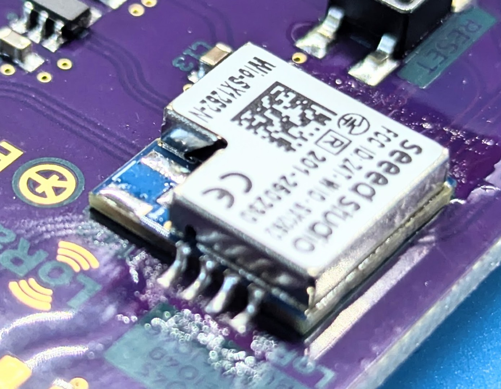
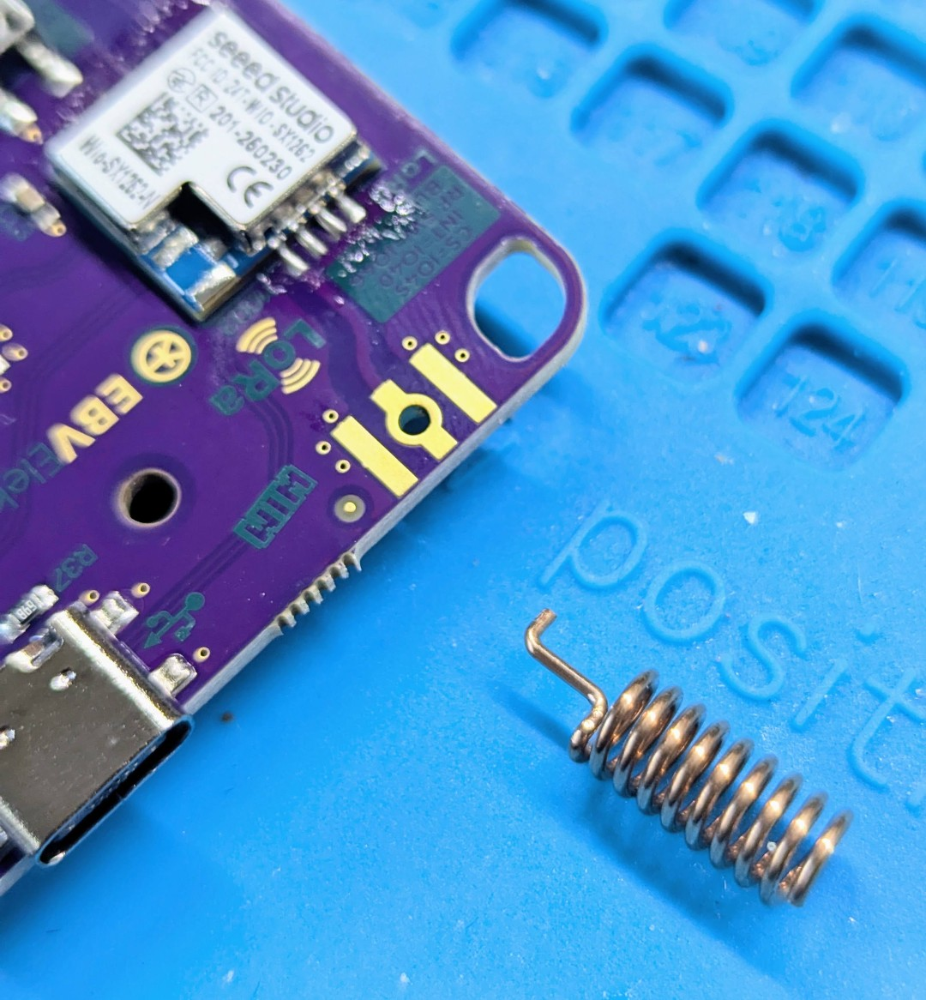
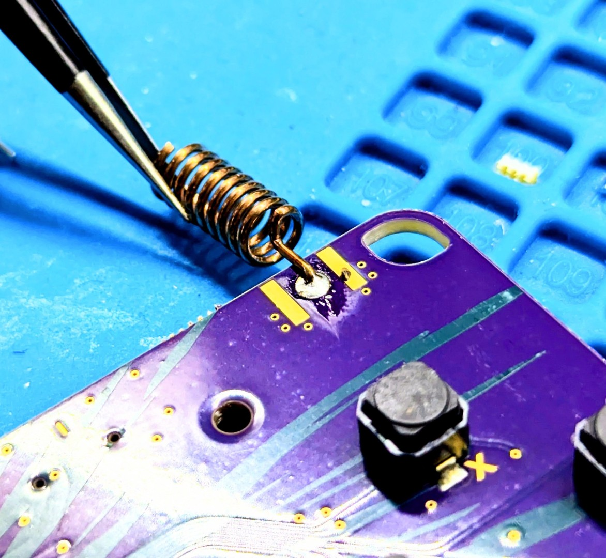
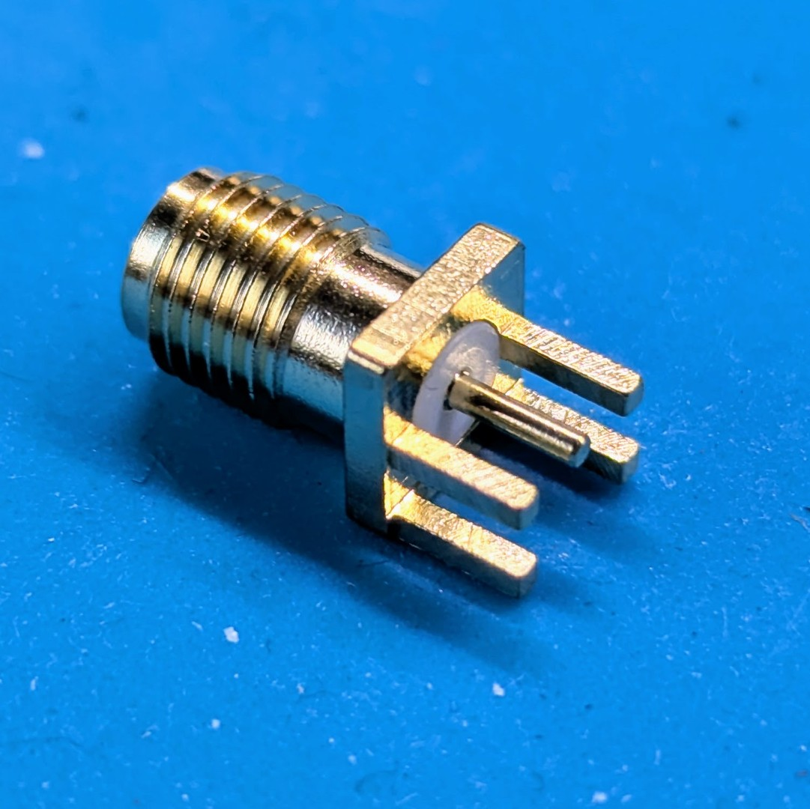

# LoRa kit

Met de LoRa kit kan je een LoRa transceiver module toevoegen aan je badge. Dit vergt wel wat soldeerwerk, maar anders zou het niet plezant zijn!
De kit bevat
- Seeedstudio Wio-SX1262-N Module
- Spiraal antenne

## Montage

Positioneer de LoRa Module op de PCB, eventueel kan je al een pad vertinnen (een beetje extra soldeersel op doen).

Soldeer eerst deze ene pin vast en verifieer dat de module goed gepositioneerd is aan beide kanten. Gebruik een pincet om de module op zijn plaats te houden wanneer je de eerste pin soldeert.

Vervolgens kan je de pinnen allemaal solderen. Let hier bij op dat je geen kortsluiting maakt tussen de pin aan de zijkant en de metalen cover. Indien het solderen niet vlot lukt, kan flux soms wonderen verrichten.

Vervolgens kan je de antenne monteren (tenzij je de uitbreiding voor de SMA connector hebt gekocht, dan kan je verder naar beneden scrollen)

Hier is het gebruik van een pincet zeer cruciaal daar de antenna behoorlijk warm kan worden tijden het solderen!

## Uitbreiding

Deze kit bevat een SMD SMA connector en een 5dBi Gain 868 antenne.

Bij het monteren van deze connector is, net zoals bij het monteren van de antenna, een hulpmiddel zoals een pincet nodig. Deze SMA connectoren worden heel warm tijdens het solderen. Hier is ook geduld belangrijk om een goede soldeer verbinding te bekomen. Het metaal dat je wil solderen op de PCB (in dit geval de SMA connector) moet warm genoeg zijn opdat het soldeersel zich er goed aan hecht.